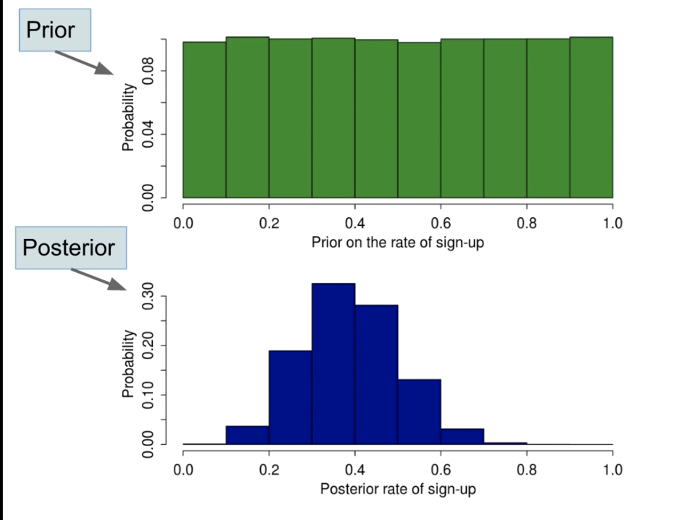

# Machine_Learning_INM431

## Contents

[Week 1 Notes](#Week-1-Notes)

[Week 2 Notes](#Week-2-Notes)

[Week 3 Notes](#Week-3-Notes)

## Week 1 Notes

### Key MatLab Commands

If you type any built in MatLab method after 'edit' in the MatLab command terminal, you will get detailed information on how the method works and even the code itself.

For example, the command below will give you detailed info on the 'cov' (covariance) method.

```
edit cov
```

### What is a Covariance Matrix?

A covariance matrix is a square matrix giving the covariance between each pair of elements of a given random vector. In the matrix diagonal there are variances, i.e., the covariance of each element with itself.

It essentially used as the covariance but in vector/matrix form. Just think of it as a table that tells you the covariance between variables.

## Week 2 Notes

## What are Parameters of a Model?

A model **parameter** is a constant configuration/setting variable that is internal to the model and whose value can be estimated from data. They are required by the model when making predictions and the values define the accuracy of the model on your problem.

## What are Hyperparameters of a Model?

A model **hyperparameter** is a configuration/setting that is external to the model and whose value cannot be estimated from data.

- They are often used in processes to help **estimate** model parameters.
- They are often specified by the practitioner.
- They can often be set using heuristics.
- They are often tuned for a given predictive modeling problem.

We cannot know the best value for a model hyperparameter on a given problem. We may use rules of thumb, copy values used on other problems, or search for the best value by trial and error.

When a machine learning algorithm is tuned for a specific problem, such as when you are using a grid search or a random search, then you are tuning the hyperparameters of the model or order to discover the parameters of the model that result in the most skillful predictions.

**If you have to specify a model parameter manually then it is probably a model hyperparameter.**

### Decision Trees

DTs are non-probabilistic, non-parametric supervised learning methods used for classification and regression problems. They are also the basis of random forests.

DTs learn from data to approximate/predict with a set of predicate logic rules, i.e. **if-then-else** decision rules. The deeper the tree, the more complex the decision rules and fitter the model.

A DT breaks down a dataset into smaller and smaller subsets while at the same time an associated DT is incrementally developed.

The final result is a tree with **decision nodes** and **leaf nodes**. So the decision nodes are basically the nodes asking the questions, and the leaf nodes represent a classification or prediction or final decision.

The top most decision node is also called the **root node**.

Example of a DT:


The leaf nodes are the bottom nodes and all the others are decision nodes (also root node).

#### Decision Tree Structure in Detail

A DT consists of:

1. Nodes containing the names of independent variables
2. Branches labelled with the possible values of independent variables
3. Leaf nodes representing the classes, that is collection of observations grouped according to the values of one independent variable and joined to nodes via branches.

##### MATLAB Decision Tree Steps for Week 2 Tutorial Exercise Part 2

1. Starting from already classified data (training), we try to define some rules that characterise the various classes. 
2. After testing the model with a test set, the resulting descriptions (classes) are generalised (inference or induction) and used to classify records whose membership class is unknown.

Remember, specifically, nodes are labelled with the attribute name, i.e. variable name, branches are labelled with the possible values of the attribute/variable, and leaf nodes are labelled with the different values of the target attribute/variable.

An object is then classified by following a path along the tree that leads from the root to a leaf. Each path represents the rules of classification or prediction. 

To summarise:

1. Start from the root
2. Select the instance attributes associated with the current node
3. Follow the branch associated with the value assigned to that attribute in the instance
4. If you reach a leaf, return the label associated with the leaf, otherwise, beginning with the current node, repeat from step 2.

**Tutorial Exercise Steps**

**Read MATLAB FOR MACHINE LEARNING pages 2889 to 3022**

We use the Fisher Iris data set for this exercise.

The data set consists of 50 samples from each of three species of Iris flowers:

Iris setosa
Iris virginica
Iris versicolor 

Four features were measured from each sample: 

Sepal Length
Sepal Width
Petal Length
Petal Width 

in cm.

Based on the combination of these four features, Fisher developed a linear discriminant model to distinguish the species from each other.

So basically we want to classify the species based on the size of its sepal and petal.

The 'meas' dataset has data for the length and width of the sepal and petal respectively (150x4). 
The 'species' dataset has data for the classification, i.e. species identifications. 

**So the rows from meas matches the row in species.**

Knowing this, we can first look at the species dataset through a frequency table:

```
tabulate(species)
```


We can see that there are equal samples of each species, i.e. the data is equally distributed.

Let us also view the features of the species using a scatter plot matrix. The scatter plot matrix shows all the scatter plots of the species features in matrix format:

```
gplotmatrix(meas, meas, species)
```

The species dataset is added as our 'group' parameter. How this works is that the gplotmatrix() method matches each observation, i.e. row in the variable vectors/matrices, in our case the columns in meas, to each value in our group dataset, i.e. species. So for example, the first 50 variable values will be matched with the setosa species and grouped. You can see this in the legend from the graph image below:


Looking at the scatter plot matrix, we can also immediately tell that the setosa (blue) is different to the other two species, where the other two species seem to share similar features.

Now let us focus our visual analysis to compare just the petal measurements between species:

```
gscatter(meas(:, 3), meas(:, 4), species, 'rgb', 'osd')
xlabel('Petal Length')
ylabel('Petal Width')
```

The 'rgb' parameter set the colours for each value in the group variable, and the 'osd' parameter sets the symbol/mark for each group with osd standing for circle, square and diamond.


From the figure, we can see that a classification is definitely possible.

**So, let us create a classification tree (decision tree)!**

First we need to split our dataset into training/test. For this example, I have just used a 70% training split:

```
P = 0.70
```

We use randperm() to get a row vector containing a random permutation of the integers from 1 to the input, in our case m = 150, without repeating elements. Permutation just means rearrangement of a set:

```
shuffled_idx = randperm(m) 
```

The round() method rounds the number to its closest integer, if 0.5 then it rounds up. 

Note! Because shuffled_idx is a vector, we can just refer to the rows, even if it is a column vector.

```
train_x = meas(shuffled_idx(1:round(P * m)), :); 
train_y = species(shuffled_idx(1:round(P * r)), :);
```

For our test split, we add +1, because we want to start from 1 after our training split. And 'end' is just to the end of our row indexes:

```
test_x = meas(shuffled_idx(round(P * m) +1:end),:);
test_y = species(shuffled_idx(round(P * r) +1:end),:);
```

The 'fitctree()' method returns a fitted **binary** decision tree based on the input and output variables respectively.

```
ClassTree = fitctree(train_x, train_y)
```

There are two ways to view our decision tree:

1. The 'view(ClassTree)' method returns a text description of the tree.

```
view(ClassTree)
```


2. The view(ClassTree, 'mode', 'graph') method returns a graphic description of the tree.

```
view(ClassTree, 'mode', 'graph')
```


Looking at the graph above, we can see that in fact only two input variables have been used to create our decision tree. These are x3 and x4, which are the length and widths of the petals. So the sepals are unused.

**Let us test our decision tree on new data!**

The predict() method predicts a new set of labels/classification using the test_x data and the trained ClassTree model:

```
labels = predict(ClassTree, test_x)
```

The 'predict()' method returns a vector/matrix of predicted class labels for the predictor data based on the trained classification tree, ClassTree in our case. 

**So how do we actually test the performance?**

We can first test it out by calculating the **resubstitution error**. This is the difference between the response training data and the predictions the tree makes of the response based on the input training data. It provides an initial estimate of the performance of the model, and it works only in one direction, in the sense that a high value for the resubstitution error indicates that the predictions of the tree will not be good. However, a low resubstitution error does not guarantee good predictions either, so it tells us nothing about it.

```
resuberror = resubLoss(ClassTree)
```

A resuberror of 0.0200 suggests that our tree classifies nearly all of our data correctly. 

To improve the measure of the predictive accuracy of our tree, we perform **cross-validation** of the tree. By default, cross-validation splits the training data into 10 parts at random. It trains 10 new trees, each one on nine parts of the data. It then examines the predictive accuracy of each new tree on the data not included in training that tree. 

Note! It cross-validates using the training data used to train our tree! So it is based on 105 observations, not the original 150! This is why it is different to splitting to train/test in the first place!

```
cvrtree = crossval(ClassTree)

cvloss = kfoldLoss(cvrtree)
```

At first, we used the crossval() method which performs an average loss estimate using cross-validation. **A cross-validated classification model was returned.** A number of properties were then available in MATLAB's work space. 

Then, we calculated the classification loss for observations not used for training by using the kfoldLoss() method, i.e. we are getting the actual loss figure from the cross-validated classification model. The low calculated value confirms the quality of the model, i.e. a low loss or difference between the prediction and actual and prediction.

**Finally, let us test our predicted labels against our test_y set**

We can do this using a **confusion matrix** to compare the test_y against the resulting labels:

```
[c order] = confusionmat(test_y, labels)
```

**How do we summarise all this together?**

In building any ML model, there are certain steps commonly followed such as:

1. Data preprocessing
2. Data partitioning into train/test
3. Training and evaluating

Technically, training is performed on train set, model is tuned on a validation set and evaluated on a test set.

**Validation set** is different from **test set**, in the sense that the validation set actually can be regarded as a part of the training set, because it is used to build your model, neural networks or others. It is usually used for parameter selection and to avoid overfitting. If your model is non-linear (like NN) and is trained on a training set only, it is very likely to get 100% accuracy and overfit, thus get very poor performance on the test set. Thus a validation set, which is independant from the training set, is  used for parameter selection. In this process, people usually use **cross validation**. 

So basically, the validation set is used for tuning the parameters of a model whilst the test set is used for performance evaluation. 

## Week 3 Notes

### Frequentist vs Bayesian Modelling

Let us assume that a set of probability distribution parameters, **Θ**, are used to try and best explain why our sample dataset, **D** has occured, i.e. our outcomes. We may wish to estimate the parameters with the help of the Bayes rule:


Note! The denominator, p(D), acts as the normalisation constant because remember, the likelihood does not necessarily sum up to 1, because it is the sum of ALL the various probabilities of getting each observation in our data given a set of parameters, and NOT the probability of a specific parameter over all observations.

#### Maximum Likelihood Estimate

With MLE, we seeking a **point estimate** for Θ, i.e. a set of individual values which maximises the likelihood, p(D|Θ). We can denote this value as 𝚯, and remember, it is a point estimate found through the derivatives with respect to each parameter, **so it is NOT a random variable**.

In other words, MLE treats the term p(Θ)/p(D) of our Bayesian rule formula, as a **constant** and does not allow us to inject our **prior beliefs**, p(Θ), about the likely values for Θ in the estimation calculations for our model. 

#### Bayesian Estimate

Bayesian estimation, by contrast, fully calculates (or at times approximates) the **posterior distribution**, p(Θ|D). So basically, Bayesian inference treats Θ as a random variable and allows us to integrate a mathematical representation of **uncertainty** in the form of a prior distribution.

In Bayesian modelling, we input probability density functions and get out probability density functions as well, rather than a single point as in MLE.

Of all the possible values for Θ made available by the output distribution, p(Θ|D), i.e. posterior distribution, it is OUR job as researchers to select a value that we consider to **best in some sense**.

For example, we may choose the expected value of Θ assuming its variance is small enough.

The variance that we can calculate for the parameter Θ **from its posterior distribution** allows us to express our confidence in any specific value we may use as an estimate. If the variance is too large, we may declare that there does not exist a good estimate for Θ.

As a trade-off, the Bayesian estimate is made complex by the fact that we now have to deal with the denominator in the Bayes rule, i.e. the **evidence**. Here, evidence or probability of evidence is represented by:


This leads to the concept of **conjugate priors**.

#### What are Conjugate Priors?

If the prior and posterior distributions are in the same family, the prior and posterior are called **conjugate distributions**. For example, the beta distribution is a conjugate prior, if the posterior also has a beta distribution. Then we can say that the beta distribution is the **conjugate family** for the likelihood distribution. So when we say conjugate, we mean 'different forms of the same entity'.

**Wait, so why are conjugate priors so important in Bayesian modelling?**

When carrying out Bayesian analysis, we assume a prior distribution for our parameters, and then sample some random parameters from this distribution and plug these into some generative model, linear regression for example, to get some simulated outcomes. Then we gather our sample data, and we match our sample data outcomes to the same simulated outcomes, and then come up with a posterior distribution based on the amount of times our matching parameter estimates came up during our initial random parameter value picks. 

 Conjugate priors are a way of bypassing this expensive computation. So if the likelihood and prior distributions are from the same family, like Binomial and Beta, we can assume that the posterior distribution will also be of the same family as the prior, and thus we just need to plug in the parameter values that "convert" the prior distribution into the other distribution family member, i.e. the posterior.

 so when we multiply two Gaussians for example, we know that the result will also be a Gaussian. The same for Beta distributions. Contrast this with the example in the lecture slides where a uniform distribution is multiplied by the likelihood and then the result needs to be normalised, that is, re-scaled to make the area under the curve equal to 1. This is what the denominator in the Bayes theorem does, i.e. the evidence. That part of the computation is expensive (can take a long time).

#### Connecting All This Together - Bayesian Modelling Steps

When you are carrying out Bayesian data analysis, you need the following three things:

1. Data
2. A Generative Model
3. Prios

A **generative model** is any kind of computer program, mathematical expression, or model that you can feed **fixed parameter values** to output **simulated data**. Typical examples are of course, probability distributions.

But of course, in the real world, we know the data but not the parameter values. So we are using Bayesian inference (one of many techniques available) to work our way back to find the parameters and the generative model that best represents our data.

So, let us quickly go through the various steps of Bayesian modelling:

1. Define the prior distribution that incorporates your subjective beliefs about a parameter(s). 

So, say we assume that our paramters have a uniform distribution (for whatever reason), we then draw a **random** parameter value from this distribution and plug in our random parameter(s) into our model (generative model) that we are using, for example a linear regression model. 

We repeat this process of drawing a random parameter(s) from the prior distribution (uniform) and then running our generative model for, however many times, 100, 1000, 100000 etc, to generate numerous amounts of **simulated data**, i.e. output results from our initial random parameter values.

2. We then gather our sample data, i.e. the actual results of the real world and compare this data to the outcomes of our generative model that we got from using our initial random parameter values. By comparing the outcomes, we filter out any parameter values that did not result in the same simulated data as our real world outcomes.

3. Next, using our filtered parameter values, we come up with a posterior distribution. How is this done? Well, say a random parameter value of 0.5 from our uniform prior distribution resulted in the same outcomes as our sample data, and from our numerous random parameter picks from the prior distribution, the value of 0.5 came up 21% of the time. So, our posterior distribution will give the outcomes from the parameter value of 0.5, a PDF of 21%. 

So by assigning our filtered parameter values with the amount of times (probability) it came up from our random draws, it will help us to model a posterior distribution, for example lets say this time it formed a Normal distribution:




So, the posterior distribution is a probability distribution that represents your updated beliefs about the parameter after having seen the data.

4. Analyse the posterior distribution and summarise it (mean, median, sd, quantiles, ...).

**Now, you might argue that, if we are picking parameters from a probability distribution that gives us the high probability estimates of getting our sample data, then is this not similar to the maximum likelihood?** Well, yes, this is why we actually call this the **Bayesian extension of the maximum likelihood estimate**.

**Finally, we carry out these steps recursively (Recursive Bayes), by updating our prior with the posterior, and thus as we carry out more and more experiments with new data, we start to get a more accurate/confident estimate of our parameter.**

### Week 3 Tutorial Exercises - Recursive Bayesian Estimation

#### Breaking Down The bayesExample MatLab Code

The **'linspace(x1, x2)'** method returns a row vector of 100 evenly spaced points between x1 and x2:

```
x = linspace(0,10,1000);
```

The third parameter, 1000, is the size of the row vector, i.e. how many elements do you want?

Next, we plot a figure with axis limits:

```
figure; hold on; axis([0 10 0 1]);
```

**'hold on'** retains plots in the current axes so that new plots added to the axes do not delete existing plots.

**'axis()'** sets axis limits, so above we have the x-axis as ranging from 0 to 10, and the y-axis from 0 to 1.

We now set the prior distribution, for this exercise it is just a normal distribution:

```
 % Prior distribution 
pm = 5; % Prior mean
ps2 = 4; % Prior variance
prior = (2*pi*ps2)^(-0.5)*exp(-0.5*(x-pm).^2/ps2);
plotPrior = plot(x,prior,'k'); % Plot 1: prior distribution
leg = legend('prior');
```

Finally, we move onto the likelihood function. There some important things to notice in the code below:

1. The first is that we have 10 loops, and within each loop we use the entire dataset in the x variable each time in the loop to set our likelihood and posterior distributions.

2. Then, under the if condition within the loop, notice the code that says:

prior = posterior; % Plot 3: product distribution 
pm = Pm;
ps2 = Ps2;

We are updating the prior with our posterior each loop to get a more accurate/confident estimate of our parameters each time.

```
% Number of recursive iterations
for i = 1:10,
    % Likelihood function 
    lm = 6; % sample mean
    ls2 = 3; % sample variance
    plotSample = plot(lm, 0, 'bx', 'MarkerSize', 16); % Plot 2: sample mean
    leg = legend('prior', 'measurement');
    
    like = (2*pi*ls2)^(-0.5)*exp(-0.5*(x-lm).^2/ls2);
    plotLike = plot(x,like); % Plot 3: sample distribution
    leg = legend('prior', 'measurement', 'likelihood');

    Ps2 = (1/ps2 + 1/ls2)^(-1);
    Pm = Ps2*(pm/ps2 + lm/ls2);
    posterior = (2*pi*Ps2)^(-0.5)*exp(-0.5*(x-Pm).^2/Ps2);
    plotPost = plot(x, posterior, 'r'); % Plot 3: product distribution
    leg = legend('prior', 'measurement', 'likelihood', 'posterior');
    
    if(i < 10),
    
        pause(1);

        delete(get(leg, 'Children'));

        delete(plotPrior);
        delete(plotLike);
        delete(plotPost);
        delete(plotSample);

        prior = posterior; % Plot 3: product distribution 
        pm = Pm;
        ps2 = Ps2;

        plotPrior = plot(x,prior,'k'); % Plot 1: prior distribution
        leg = legend('prior');
    end;
end;
```
#### Coin Flipping with Recursive Bayes Inference

Let us first organise our model into these steps:

1. Set the number of experiments (coin flip trials) we want for our model:

```
coin_tosses = 100;
```

2. Give our bias, i.e. probability of flipping a heads, of:

```
bias_heads = 0.5
```

The bias (our belief of what value the parameters of our model will be), is the parameter we are trying to estimate for our model, i.e. the probability of flipping a heads each time.

3. Set a discrete distribution for all the possible biases between 0 and 1:

```
possible_coin_toss_biases = linspace(0,1,100);
```

4. We assign a prior probability distribution to each of our parameter estimates (bias possibilities):

```
prior_uniform_coin_tosses = ones(length(possible_coin_toss_biases),1)/length(possible_coin_toss_biases);
```

5. Let us now simulate 100 trials/experiments of coin tosses:

```
coin_flip_samples = double(rand(coin_tosses, 1) < bias_heads);
```

The code above assigns a value of 0 (Tails) if our random value (toss result) is below 0.5 and a 1 (Heads) if above or equal to 0.5.

6. Finally, based on our sample data, we need to keep updating our prior distribution for 100 experiments and see what kind of estimate we get for the "true" bias.

One important thing to note here is that we have assigned a Binomial distribution for our likelihood function. This means our model does not have a conjugate prior, as is the case for a lot of real world models:

```
for k=1:coin_tosses
    % Calculate prior, likelihood, and evidence
    prior = prior_uniform_coin_tosses;
    % Remember! Although having conjugate priors is the best case scenario
    % for Bayes modelling, most experiments do not have conjugate priors.
    % Like in this case where the likelihood, i.e. distribution for the
    % data given our parameter estimates, will have a Binomial distribution
    % since our data will take only one of two categorical values, 0 or 1.
    % Thus the likelihood function below is for a Binomial distribution.
    likelihood = possible_coin_toss_biases'.^coin_flip_samples(k).*(1-possible_coin_toss_biases').^(1-coin_flip_samples(k));
    evidence = sum(likelihood .* prior);
    
    % Calculate the posterior distribution
    posterior = likelihood .* prior ./ evidence;
    
    % Dynamically plot the posterior distribution
    figure(1);
    plot(possible_coin_toss_biases', prior_uniform_coin_tosses);
    title(sprintf('Flip %d out of %d', k, coin_tosses));
    xlabel('Heads Bias'); ylabel('P(Heads Bias | Flips)');
    ylim([0 1]);
    set(gca,'Xtick',0:0.1:1);
    drawnow;

    % Make the posterior distribution the next prior distribution
    prior_uniform_coin_tosses = posterior;
end
```